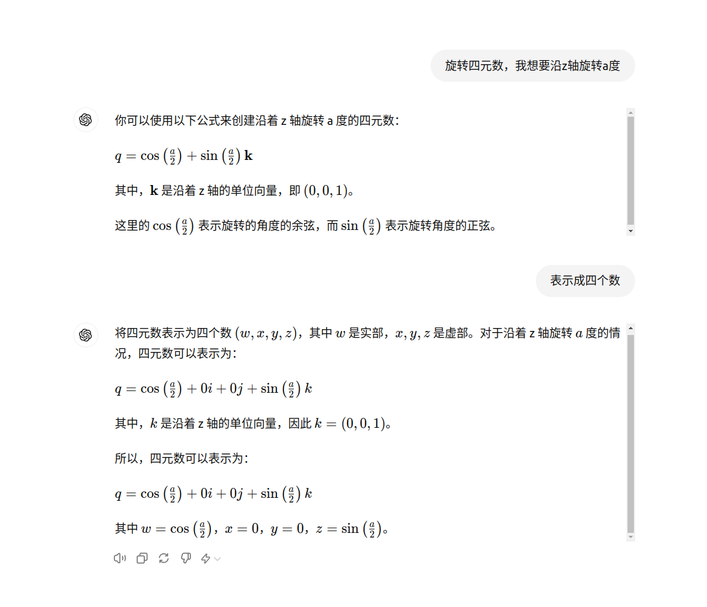

# drone-hz

## send_velocity_command(double linear_x, double linear_y, double linear_z)

x为左右方向。x正为右，x负为左 
y为前后方向。y正为前，y负为后 
z为上下方向。z正为上，z负为下 
符合右手直角

## !!!7.13重大发现
    auto local_vel_pub = node->create_publisher<geometry_msgs::msg::TwistStamped>("/mavros/setpoint_velocity/cmd_vel", 5);

geometry_msgs::msg::TwistStamped中的线速度，不是按照机身坐标系来的，它的坐标系与mavros/setpoint_position/local中的坐标系相同，是一个，x正方向指向东，y正方向指向北，z正方向指向上的直角坐标系。